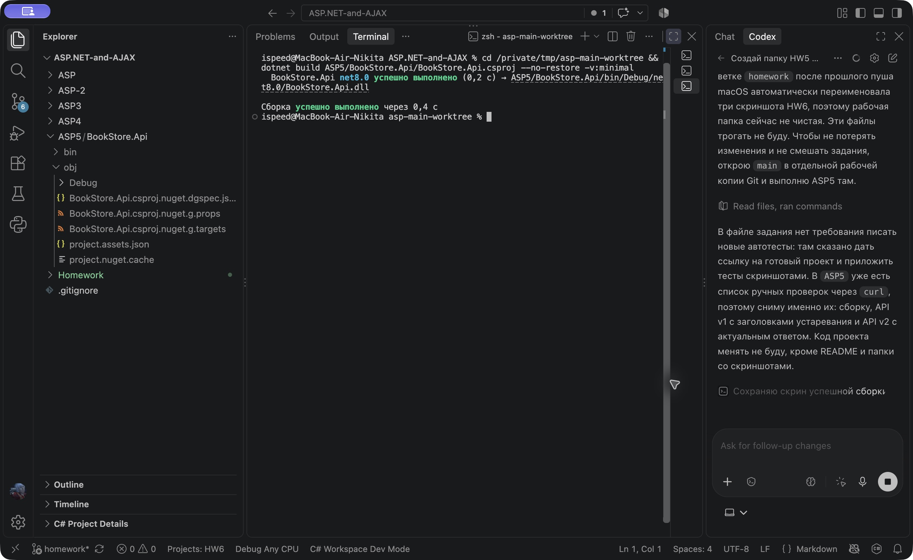
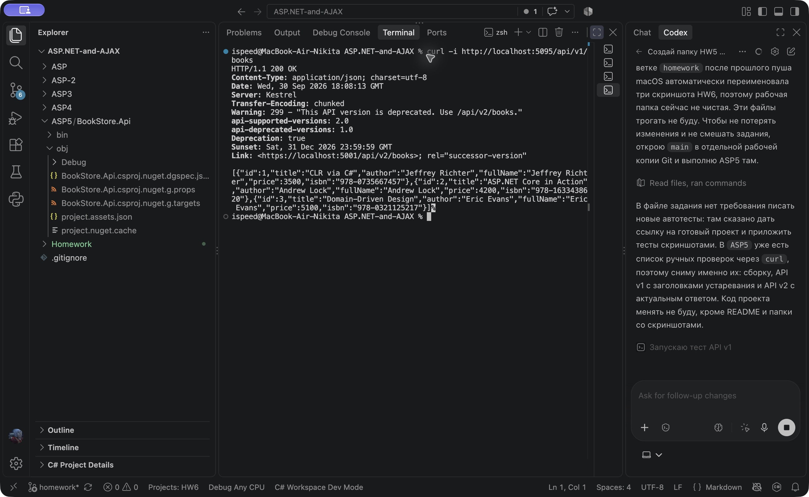
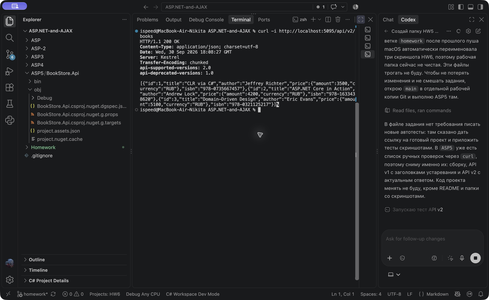

# ASP5 — BookStore.Api

Проект повторяет архитектуру с референса и подключён как отдельное задание внутри общей папки репозитория.

## Создание и установка пакетов

```bash
mkdir ASP5
cd ASP5
dotnet new webapi -n BookStore.Api --use-controllers
cd BookStore.Api

dotnet add package Asp.Versioning.Mvc --version 8.1.0
dotnet add package Asp.Versioning.Mvc.ApiExplorer --version 8.1.0
dotnet add package Microsoft.FeatureManagement.AspNetCore --version 3.5.0
dotnet add package Swashbuckle.AspNetCore --version 6.6.2
```

## Запуск

```bash
dotnet run
```

В проекте доступны версии API:

- `GET /api/v1/books` — устаревшая версия, добавляет заголовки Deprecation/Sunset.
- `GET /api/v2/books` — актуальная версия с расширенной моделью ответа.
- `/swagger` — документация Swagger для обеих версий в Development.

Функциональность v2 управляется флагом `FeatureManagement:BooksV2` в `appsettings.json`.

## Ручные проверки API

```bash
curl -k https://localhost:5001/api/books
curl -k https://localhost:5001/api/v1/books
curl -k https://localhost:5001/api/v2/books
curl -k -I https://localhost:5001/api/v1/books

curl -k -X POST https://localhost:5001/api/v1/books \
  -H "Content-Type: application/json" \
  -d '{"title":"Refactoring","author":"Martin Fowler","price":2500,"isbn":"978-0134757599"}'

curl -k -X POST https://localhost:5001/api/v2/books \
  -H "Content-Type: application/json" \
  -d '{"title":"Refactoring","author":"Martin Fowler","price":{"amount":2500,"currency":"RUB"}}'

curl -k "https://localhost:5001/api/books?api-version=2.0"
curl -k -H "api-version: 2.0" https://localhost:5001/api/books
```

## Скриншоты тестирования

Успешная сборка проекта:



Проверка API v1. Ответ `200 OK` содержит заголовки `Deprecation`, `Sunset`
и ссылку на актуальную версию API:



Проверка API v2. Ответ `200 OK` содержит актуальную модель цены с суммой и
валютой:


