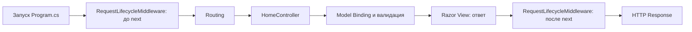

# Схема жизненного цикла

## Что видно в коде

- `Program.cs` подключает middleware через `app.UseMiddleware<...>()`.
- `RequestLifecycleMiddleware` фиксирует четыре контрольные точки в логах.
- `HomeController` принимает форму и возвращает результат.
- `RegistrationRequest` содержит серверные правила валидации.

## Скриншоты

- `screenshots/01-form.png` — форма заявки.
- `screenshots/02-success.png` — результат успешной отправки.
- `screenshots/03-lifecycle.png` — страница этапов жизненного цикла.