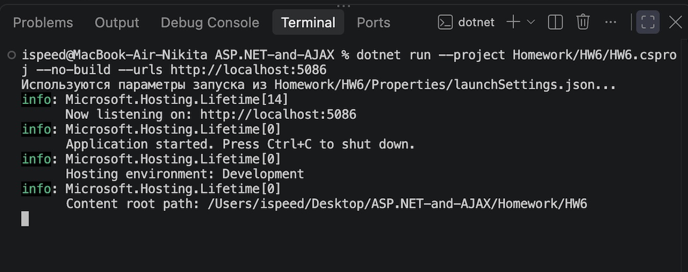
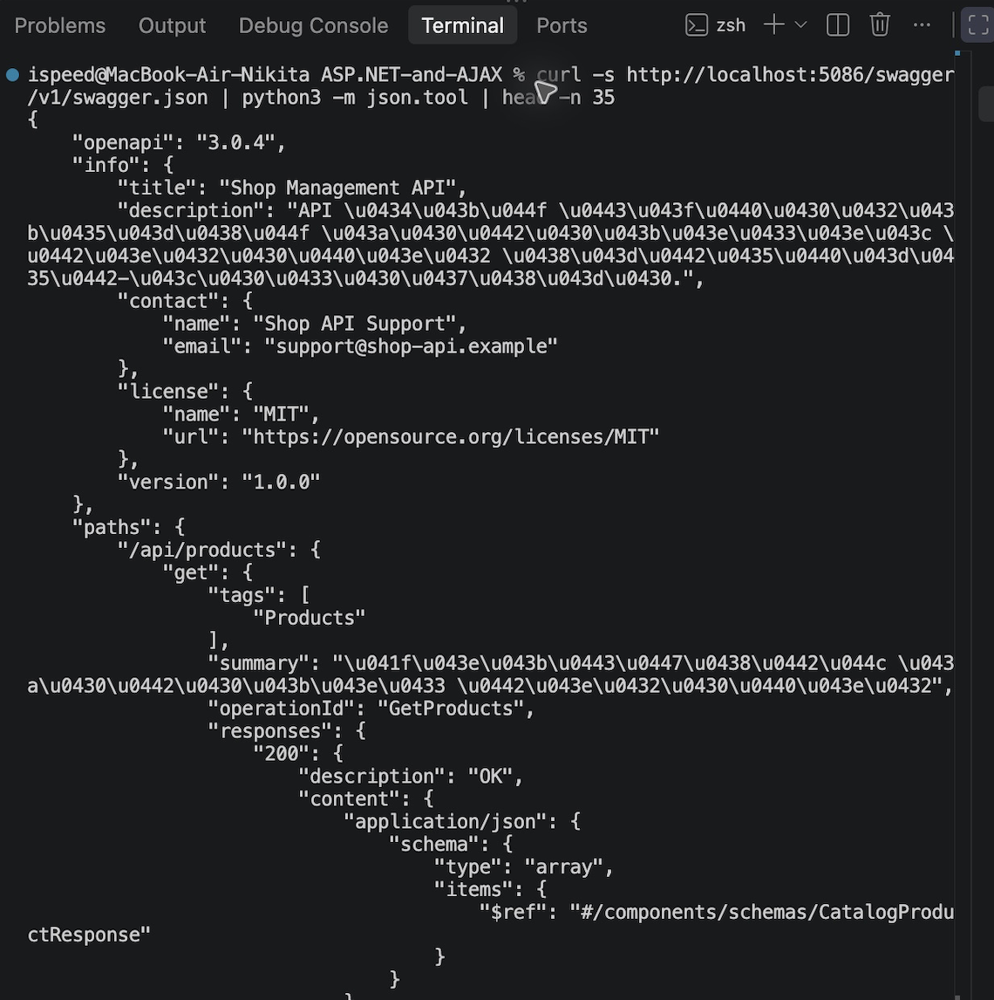
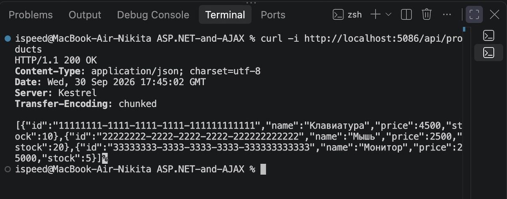

# HW6 — OpenAPI-документация

Проект представляет REST API каталога магазина. В него добавлена документация
OpenAPI/Swagger с метаданными проекта из задания:

- название: `Shop Management API`;
- версия: `1.0.0`;
- описание API товаров и заказов;
- контакт поддержки;
- лицензия MIT.

## Запуск

```bash
dotnet run --project Homework/HW6/HW6.csproj --urls http://localhost:5086
```

Swagger UI доступен по адресу:

```text
http://localhost:5086/swagger
```

OpenAPI-документ можно проверить из командной строки:

```bash
curl -i http://localhost:5086/swagger/v1/swagger.json
curl -s http://localhost:5086/swagger/v1/swagger.json | head -c 1000
curl -i http://localhost:5086/api/products
```

Список API содержит чтение и создание товаров. Пример создания товара:

```bash
curl -i -X POST http://localhost:5086/api/products \
  -H 'Content-Type: application/json' \
  -d '{"name":"Веб-камера","price":6500,"stock":8}'
```

## Скриншоты проверки из терминала

Запуск приложения и прослушивание порта `5086`:



Получение OpenAPI-документа командой `curl`:



Запрос списка товаров с ответом `HTTP/1.1 200 OK`:


